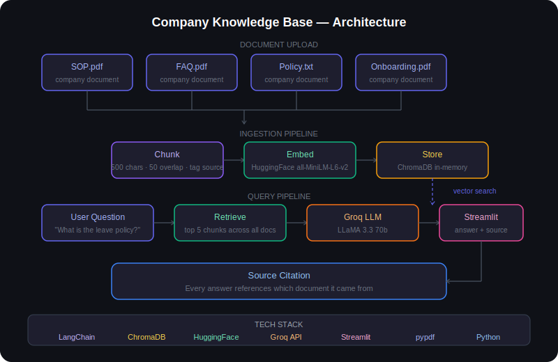

# Company Knowledge Base

A RAG-powered document assistant that lets you upload multiple company documents and ask questions across all of them in a single conversation. Instead of searching through folders or manually reading through PDFs, ask in plain English and get a specific answer with the source document cited.

## Live Demo

[Live Demo](https://company-knowledge-base.streamlit.app/)

## What It Does

Upload any number of company documents — SOPs, FAQs, policy manuals, product guides, onboarding materials. The app builds a unified knowledge base from all of them and answers questions by retrieving the most relevant sections across all documents simultaneously.

Ask it:
- "What is the leave policy?"
- "Summarize all uploaded documents"
- "What are the key policies across these documents?"
- "What action items are mentioned?"
- Or any custom question about your documents

## How It Works

```
Upload multiple documents (PDF or TXT)
              ↓
           CHUNK
Each document split into 500-character chunks
Tagged with filename as source
              ↓
           EMBED
Convert chunks to vectors using HuggingFace
sentence-transformers (all-MiniLM-L6-v2)
              ↓
           STORE
All chunks stored in unified ChromaDB (in-memory)
              ↓
          RETRIEVE
Search across ALL documents simultaneously
Top 5 most relevant chunks returned
              ↓
           ANSWER
Groq LLM answers using retrieved context
Source document cited in every response
              ↓
     Streamlit chat UI displays answer + sources
```
## Architecture



## Tech Stack

| Tool | Purpose |
|---|---|
| Python | Core application logic |
| LangChain | Document loading, chunking, retrieval pipeline |
| ChromaDB | In-memory vector database |
| HuggingFace | Embedding model (all-MiniLM-L6-v2) |
| Groq API | LLM inference (LLaMA 3.3 70b) |
| Streamlit | Web UI and deployment |
| pypdf | PDF text extraction |
| python-dotenv | Environment variable management |

## Setup — Run Locally

**1. Clone the repo**
```bash
git clone https://github.com/yourusername/company-knowledge-base
cd company-knowledge-base
```

**2. Install dependencies**

With uv (recommended):
```bash
uv sync
```

Or with pip:
```bash
pip install -r requirements.txt
```

**3. Add your API key**

Create a `.env` file:
```
GROQ_API_KEY=your_groq_key_here
```

**4. Run the app**
```bash
streamlit run app.py
```

Open `http://localhost:8501` in your browser.

## Setup — Deploy on Streamlit Cloud

1. Push repo to GitHub
2. Go to share.streamlit.io
3. Click Create app and select this repo
4. Set main file to `app.py`
5. Under Advanced settings add secret:
```
GROQ_API_KEY="your_groq_key_here"
```
6. Click Deploy

## Usage

1. Upload one or more documents — PDF or TXT
2. Click Build Knowledge Base
3. Use suggested questions or type your own
4. Every answer cites which document it came from
5. Click Upload new documents anytime to start fresh

## Real World Use Cases

- HR chatbot — employees ask about leave policy, benefits, procedures
- Support agent assistant — queries product docs to answer customer questions
- Client onboarding bot — new clients ask about processes and deliverables
- Internal wiki replacement — ask instead of search

## Key Design Decisions

- **In-memory ChromaDB** — no file persistence means uploaded documents are never stored on disk. Each session is isolated and private — appropriate for sensitive company documents.
- **Unified retrieval across all documents** — all documents are searched simultaneously, not one at a time. The most relevant chunks are retrieved regardless of which document they came from.
- **Source citation on every answer** — every response includes which document the answer came from, making the chatbot trustworthy and auditable for business use.
- **Multiple file upload** — unlike most RAG demos that handle one document, this handles an entire document library in a single session.
- **Groq over OpenAI** — faster inference, free tier, no cost during development and demos.

## Difference from Ask My CV

| | Ask My CV | Company Knowledge Base |
|---|---|---|
| Documents | 2 fixed (CV + Job Description) | Unlimited — any documents |
| Purpose | Job fit analysis | General knowledge querying |
| Retrieval | CV and JD retrieved separately | All docs searched together |
| Audience | Individual job seekers | Business teams |
| Source citation | Not needed | Required — cited on every answer |

## What is RAG?

RAG (Retrieval Augmented Generation) gives the LLM access to your documents at query time without retraining it. The AI does not memorize your documents — it gets handed the relevant pages right before answering each question. This means answers are grounded in your actual content, responses stay current when documents change, and sensitive data is never baked into the model.

## Skills Demonstrated

`Python` `LangChain` `RAG` `ChromaDB` `Vector Embeddings` `HuggingFace` `Groq API` `Prompt Engineering` `Streamlit` `pypdf` `Multi-document Retrieval`